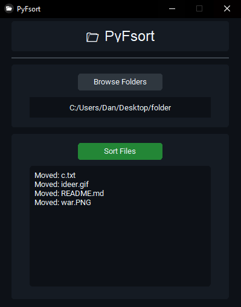

# 📂 PyFsort

A clean file sorter built with Python and CustomTkinter. Automatically organizes files into folders by their extension.


## ✨ Features
- Browse and select any folder with a single click
- Automatically creates subfolders named after file extensions (e.g., .txt, .jpg)
- Moves files into the correct subfolder
- Skips files that are already sorted
- Console log shows real-time progress of sorting

## 📸 Screenshot


## 🚀 How to Run

**Option 1 - As Python Script**
```bash
1. pip install -r requirements.txt
2. python PyFsort.py
```

**Option 2 - Standalone Executable**

1. Download the latest `.exe` from [Releases](../../releases) and run it.

## 🛠️ Tech Stack
- Python 3
- CustomTkinter
- Standard library (os, shutil)

## 📄 License
This project is open source and available under the MIT License.
